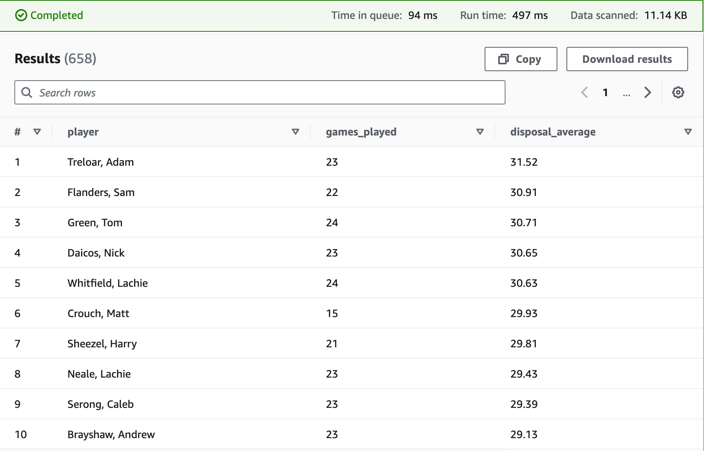

# AFL Data Platform

The AFL Data Platform is an AWS cloud data platform to support analytics and machine learning for data related to the Australian Football League (AFL). The platform captures data from 1897-present and updates every Monday morning.

## Architecture

## Features

- Web scraping
- Batch ingestion
- End-to-end orchestration
- Data cataloging
- In-database transformations

## Demo

### Query

### Result

